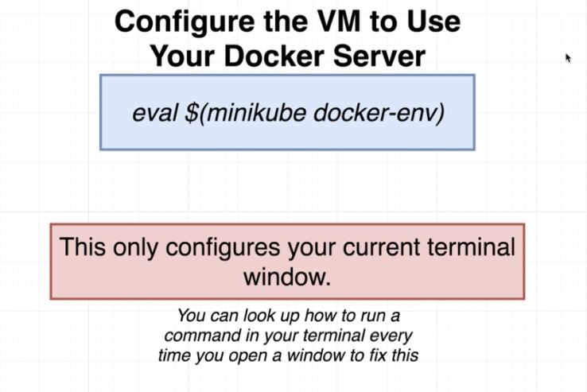
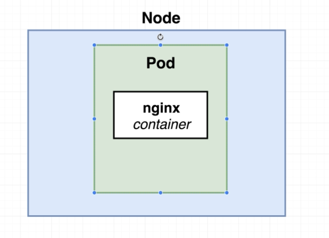
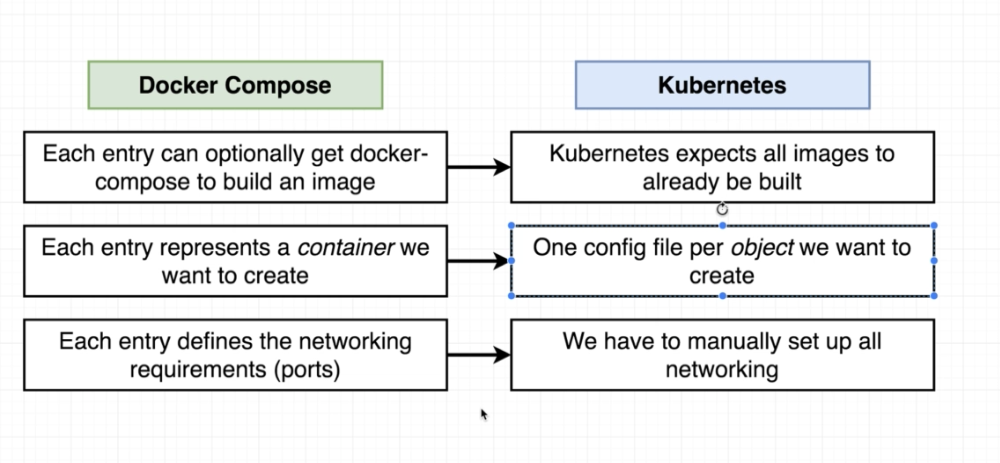
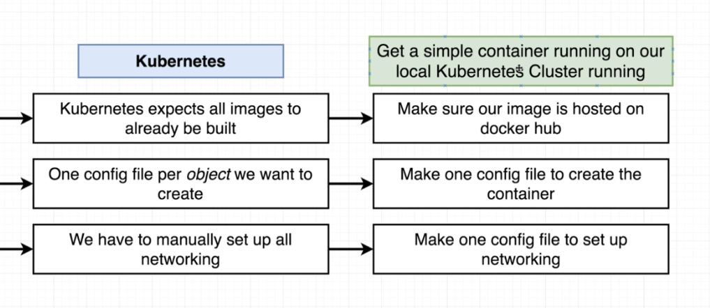

# kubernetes
## Notice
- 예제 환경 실습을 위해서는 2가지 조건이 충족되어야 함.
  - k8s is runnung
  - minukube start
  - minikube kubectl

- 일시적으로 mac의 docker-client를 minukube내의 docker-server로 연결시키는 방법.
  - `eval` 명령을 내리면 current terminal에만 변경사항이 적용된다.


```
~/workspace/udemy/simeplek8s  ‹master*› $ docker ps                                                                                                  127 ↵
CONTAINER ID        IMAGE               COMMAND                  CREATED             STATUS                          PORTS               NAMES
e40c9a8bf01f        complex_nginx       "nginx -g 'daemon of…"   3 days ago          Restarting (1) 41 seconds ago                       complex_nginx_1
~/workspace/udemy/simeplek8s  ‹master*› $ eval $(minikube docker-env)
~/workspace/udemy/simeplek8s  ‹master*› $ docker ps
CONTAINER ID        IMAGE                        COMMAND                  CREATED             STATUS              PORTS               NAMES
03b0261815ac        stephengrider/multi-client   "nginx -g 'daemon of…"   About an hour ago   Up About an hour                        k8s_client_client-deployment-85c9c4447b-wjdrh_default_447eb3ac-e36c-43e6-becb-2273c15b63e9_0
020dfe22dbc8        k8s.gcr.io/pause:3.1         "/pause"                 About an hour ago   Up About an hour                        k8s_POD_client-deployment-85c9c4447b-wjdrh_default_447eb3ac-e36c-43e6-becb-2273c15b63e9_0
0b62103deecd        4689081edb10                 "/storage-provisioner"   2 hours ago         Up 2 hours                              k8s_storage-provisioner_storage-provisioner_kube-system_d8ac864f-eb76-4732-80f3-b7bbd22fdc63_4
d719cdd9ecde        bf261d157914                 "/coredns -conf /etc…"   2 hours ago         Up 2 hours                              k8s_coredns_coredns-5644d7b6d9-2gv6m_kube-system_452e9c4c-87a1-4cd1-90d4-2a9dcd6a861b_2
d62a7b5a4bea        8454cbe08dc9                 "/usr/local/bin/kube…"   2 hours ago         Up 2 hours                              k8s_kube-proxy_kube-proxy-phlhs_kube-system_bd29e8fb-1a99-4149-a4a6-5d61c5a00c97_2
(...)
```


## Summary
- k8s에서는 이미지를 빌드하는 일이 없다.
- k8s에서는 오직 object(pod, service, controller ..)를 배포한다.
  - pod 은 앱이 배포되는 가장 작은 단위라고 생각해도 된다.
  - service는 앱들을 앞단에 위치하여 앱이 증설되는 경우 확장을 쉽게 할 수 있도록 해주는 역할을 한다.
- docker-compose 로 컨테이너를 운영하는 경우, 하나의 컨테이너가 죽어도 다른 컨테이너는 살아 있는 상태로 동작한다. 하지만, k8s 에서는 같은 서비스 목적으로 배포되는 컨테이너는 매우 강하게 결합(tightly coupled)되어 있기 때문에, 하나만 죽어도 전체가 다 죽는다.(pod 단위로 죽거나 살린다.)
- k8s는 label-selector 시스템을 사용한다. config 파일에서 직접적으로 다른 pod을 지칭하는 name을 쓰지 않고, `selector`에 정의된 `component` key-value pair를 사용한다. [[참고]](https://kubernetes.io/ko/docs/concepts/overview/working-with-objects/labels/)
  - `pod`에서 `label`을 붙이면, `service` 에서 `selector`로 선택한다.
- k8s 문서들을 보면 2가지 접근 방식이 있다.
  - Imperative(명령형)
  - Declarative(선언적)
  - 실제 production 환경에서는 무조건 declarative 한 방법만 사용해야 한다.

- [이미지 태그 변경없이 pod 이미지 바꾸는 방법.](https://github.com/kubernetes/kubernetes/issues/33664)
  - pod을 직접 지워서 업데이트 시키기(가장 안 좋은 접근 방법)
  - image version을 업데이트 시켜서 새로 이미지를 받음(declarative한 방법)
  - imperative한 방법으로 이미지 업데이트.

- docker명령어에 대응되는 명령어가 kubectl에도 준비되어 있다. (docker 명령어의 첫번째 arg만 kubectl만 바꾸면 되는 수준)

## Glossary
- Object : k8s에 의해서 생성되는 가장 기본 구성단위
  - pods : runs one or more closely related containers
  - services : sets up networking in a k8s cluster
  - deployment : maintains a set of identical pods, ensuring that they have the correct config and that the right number exists.

- apiVersion : k8s 에서 제공하는 API를 뜻함. 각 api 마다 기능이 다르기 때문에, 사용하는 용도에 따라 다른 API를 선택해야 한다.
[참고](https://matthewpalmer.net/kubernetes-app-developer/articles/kubernetes-apiversion-definition-guide.html)

## minukube(VM)
### Our test environment

- Node means VM

- kubernetes test environment ==> VM !!
> Going forward, any minikube commands run in the lecture videos can be ignored. Also, instead of the IP address used in the video lectures when using minikube, we use localhost.

> For example, in the first project where we deploy our simple React app, using minikube we would visit:
> 192.168.99.101:31515

> Instead, when using Docker Desktop's Kubernetes, we would visit: localhost:31515

> Also, you can skim through the discussion about needing to use the local Docker node in the "Multiple Docker Installations" and "Why Mess with Docker in the Node" lectures (187-189), this only applies to minikube users.

### minikube command
- minukube start/stop/status
- minukube ip

## Difference between `docker-compose` and `k8s`
- docker-compose can build image
- k8s only use already build image



- Final goal



## k8s
### k8s commands
- `kubectl cluster-info`
- `kubectl apply -f <config file>`
  - create pod
- `kubectl apply -f <service file>`
  - configure service
- `kubectl get pods`
  - show pods
```
~/workspace/udemy/simeplek8s  ‹master*› $ kubectl get pods
NAME         READY   STATUS    RESTARTS   AGE
client-pod   1/1     Running   0          109s
```

- `kubectl get services`
  - show services

```
youk@cs-macbook ~/workspace/udemy/simeplek8s ±master⚡ » kubectl get pods
NAME     READY   STATUS    RESTARTS   AGE
client   1/1     Running   0          2m39s
```
- kubectl get services
  - show services
 ```
youk@cs-macbook ~/workspace/udemy/simeplek8s ±master⚡ » kubectl get services
NAME               TYPE        CLUSTER-IP       EXTERNAL-IP   PORT(S)          AGE
client-node-port   NodePort    10.111.123.240   <none>        3050:31515/TCP   2m25s
kubernetes         ClusterIP   10.96.0.1        <none>        443/TCP          107m
```

- `kubectl describe <object type> <object name>`
  - ex) `kubectl describe pod client-pod`
```
~/workspace/udemy/simeplek8s  ‹master*› $ kubectl describe pod client-pod
Name:               client-pod
Namespace:          default
Priority:           0
PriorityClassName:  <none>
Node:               minikube/192.168.64.2
Start Time:         Sat, 02 Nov 2019 23:07:36 +0900
Labels:             component=web
Annotations:        kubectl.kubernetes.io/last-applied-configuration:
                      {"apiVersion":"v1","kind":"Pod","metadata":{"annotations":{},"labels":{"component":"web"},"name":"client-pod","namespace":"default"},"spec...
Status:             Running
IP:                 172.17.0.5
(...)
```
- `kubectl delete -f <config file>`
  - remove object

- `kubectl get all`
  - API 버전에 따라 다르게 나올 수 있음.
  - DESIRED : 가고자 하는 상태
  - CURRENT : 현재 상태
  - UP-TO-DATE : 현재 진행 상태
  - READY : 전체 replica set 중 몇 개가 가능하니 보여줌.
```
~/workspace/udemy/simeplek8s  ‹master*› $ kubectl get all
NAME                                     READY   STATUS             RESTARTS   AGE
pod/client-deployment-74d694c9bd-wml5r   0/1     ImagePullBackOff   0          24m

NAME                       TYPE        CLUSTER-IP     EXTERNAL-IP   PORT(S)          AGE
service/client-node-port   NodePort    10.96.201.83   <none>        3050:31515/TCP   4m12s
service/kubernetes         ClusterIP   10.96.0.1      <none>        443/TCP          2d2h

NAME                                READY   UP-TO-DATE   AVAILABLE   AGE
deployment.apps/client-deployment   0/1     1            0           24m

NAME                                           DESIRED   CURRENT   READY   AGE
replicaset.apps/client-deployment-74d694c9bd   1         1         0       24m
```

- `kubectl get deployments`
  - 아래는 `replicaset`을 3으로 늘려서 재적용 후 증설되는 과정을 보여줌.
```
~/workspace/udemy/simeplek8s  ‹master*› $ kubectl apply -f client-deployment.yaml
deployment.apps/client-deployment configured
~/workspace/udemy/simeplek8s  ‹master*› $ kubectl get deployments
NAME                READY   UP-TO-DATE   AVAILABLE   AGE
client-deployment   1/3     3            1           5m7s
~/workspace/udemy/simeplek8s  ‹master*› $ kubectl get deployments
NAME                READY   UP-TO-DATE   AVAILABLE   AGE
client-deployment   2/3     3            2           5m14s
~/workspace/udemy/simeplek8s  ‹master*› $ kubectl get deployments
NAME                READY   UP-TO-DATE   AVAILABLE   AGE
client-deployment   3/3     3            3           5m21s
```

- `kubectl get pods -o wide`
  - pod이 vm 내에서 172.17.0.5 의 ip 를 할당받았음을 알 수 있다.
```
~/workspace/udemy/simeplek8s  ‹master*› $ kubectl get pods -o wide
NAME                                 READY   STATUS    RESTARTS   AGE   IP           NODE       NOMINATED NODE   READINESS GATES
client-deployment-85c9c4447b-wjdrh   1/1     Running   0          11m   172.17.0.5   minikube   <none>           <none>
```

- **Related with issue #33664** -
- `kubectl set image <object type>/<object name> <container name>=<new image to use>`
  - object type : pods, deployments, ...
  - object name : `metadata`, `name` section.
  - container name : Name of container we are updating(get this from config file).
  - **Imperative command to update image in kubernetes.**
  - `kubectl set image deployment/client-deployment client=stephengrider/multi-client:v5`

---------
> Service object
```
apiVersion: v1
kind: Service  <-- Type of object
metadata:
  name: client-node-port
spec:
  type: NodePort
  ports:
  - port: 3050  # <-- 다른 pod이 multi-client pod에 접속 할 수 있는 port
    targetPort: 3000 # <-- container port
    nodePort: 31515 # <-- exposed outside(access from webbrowser)
  selector:
    component: web
```

> Pod object
```
apiVersion: v1
kind: Pod
metadata:
  name: client
  labels:
    component: web  # It can be "tier: front", whatever key-value pair possible.
spec:
  containers:
  - name: client
    image: csyouk/multi-client
    ports:
      - containerPort: 3000
```
